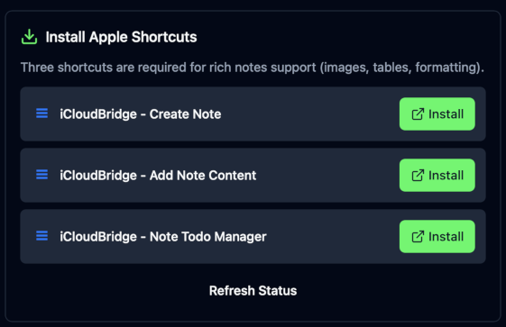
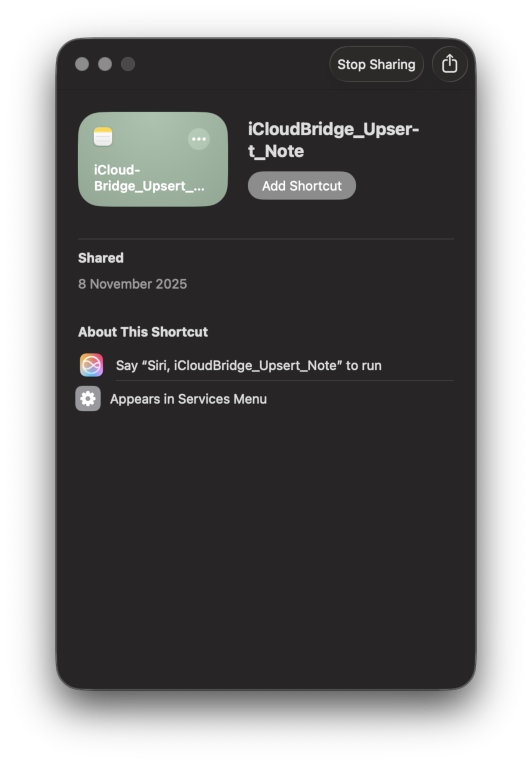
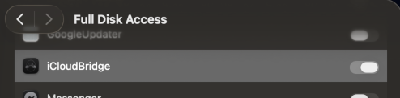
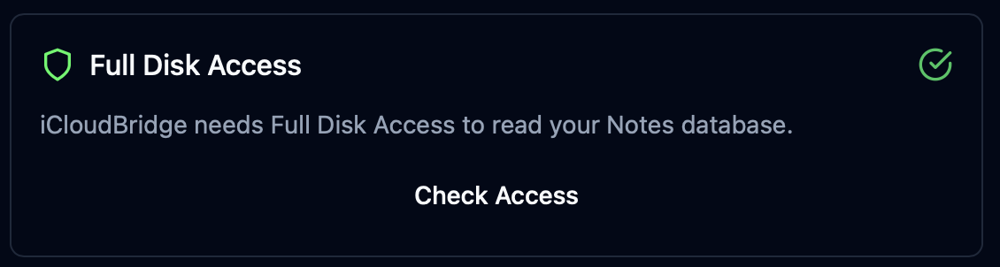
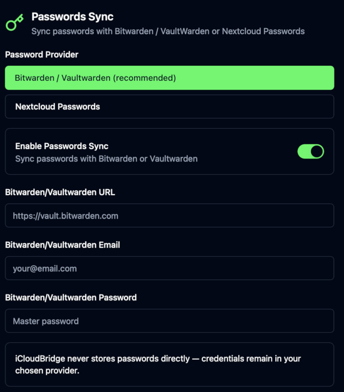
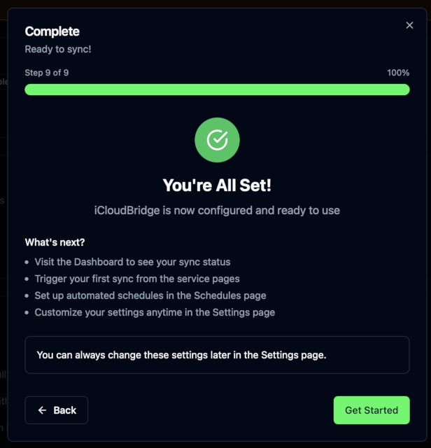

# iCloudBridge User Guide

[< Back to Table of Contents](user.md)

## First-Run Wizard

When you first open the WebUI, you'll be guided through a setup wizard to configure your synchronisation preferences.

Using the first-run wizard, you can choose which services you want to synchronise, and what to synchronise them with. 

> [!IMPORTANT]
> Although the web interface can be accessed from any device on your local network, we recommend you perform initial setup on the same machine that is running iCloudBridge. This is required to allow for permission setup and Apple Shortcut installation.

The first step in the first-run wizard is to select a location for your Data Directory. For most users, the default location is fine. This is where iCloudBridge will store your synced data.

Next, we'll configure Apple Notes synchronisation.

### First-Run Wizard: Apple Notes
If you want to synchronise Apple Notes, enable the toggle. 

You must now choose when your notes will be synchronised. iCloudBridge will create folders in this location, one for each of your Apple Notes folders. Each note will be stored as a Markdown file, with any attachments stored in a hidden subfolder.

> [!TIP]
> If you're using Nextcloud, choose the folder where your Nextcloud desktop app stores > your notes. Normally, this is in `Notes` in your Nextcloud folder.

iCloudBridge uses three Apple Shortcuts to facilitate Notes synchronisation. You will need to install these shortcuts on your machine. The first-run wizard will check whether the shortcuts are installed, and prompt you to install them if they are not found.

Click on each of the "Install" buttons to install the required shortcuts. This will open the Shortcuts app and prompt you to add the shortcut. Repeat this for all three shortcuts.

Once all shortcuts are installed, you can click "Refresh Status" to verify.

Next, we need to make sure iCloudBridge has permission to read your Apple Notes database. 

Click "Open System Settings" to open the correct page in System Settings and grand iCloudBridge Full Disk Access. The app should already be in the list - so all you need to do is enable the toggle. If it's not there, you can drag the iCloudBridge icon to that list, or click "+" and find iCloudBridge (probably in your Applications folder). 

When the prompt comes up, go ahead and click "Quit & Reopen". Once that's done, click "Check Access" in the iCloudBridge UI - you should see a green checkmark. 

> [!NOTE]
> By default, iCloudBridge will associate any folder in Apple Notes with folders of the same name in your chosen synchronisation location. If you want to change this mapping, you can do so later in the Settings page.

### First-Run Wizard: Apple Reminders
If you want to synchronise Apple Reminders, enable the toggle.

> [!TIP]
> If you're synchronising with Nextcloud, ensure the "Use Nextcloud" option is enabled, > as this will build the correct server address for you. 

Fill in the required fields, as follows:

- **Nextcloud URL**: If you're using Nextcloud, add the address you normally use to access Nextcloud on the web here.
- **Username**: Your Nextcloud username, or CalDAV username if using another CalDAV server.
- **Password**: Your Nextcloud password, or CalDAV password if using another CalDAV server.
- **CalDAV URL**: This is filled in automaitically if you're using Nextcloud. If you're using another CalDAV server, enter the CalDAV URL here.

> [!NOTE]
> By default, iCloudBridge will associate any list in Apple Reminders with TODO calendars of the same name in Nextcloud or your CalDAV server. If you want to change this mapping, you can do so later in the Settings page.

### First-Run Wizard: Apple Passwords
Your first decision is whether you want to sync your passwords with Bitwarden/Vaultwarden or the Nextcloud Passwords app. Select the appropriate option.

> [!WARNING]
> Bitwarden/Vaultwarden is strongly recommended for password synchronisation as 
> Nextcloud Passwords app does not support TOTP (i.e. one-time passwords for 2FA).

After choosing your synchronisation target, enable the toggle to set up Apple Passwords synchronisation.

Fill in the required fields, as follows:

**If using Bitwarden/Vaultwarden:**
- **Bitwarden/Vaultwarden URL**: If you're using Bitwarden or Vaultwarden, enter the server address here. If you're using Bitwarden, this is typically either `https://vault.bitwarden.com` or `https://vault.bitwarden.eu`. If you're using Vaultwarden self-hosted, enter your server's address.
- **Bitwarden/Vaultwarden Email**: Your Bitwarden/Vaultwarden email username.
- **Bitwarden/Vaultwarden Password**: Your Bitwarden/Vaultwarden master password.

**If using Nextcloud Passwords app:**
- **Nextcloud URL**: If you're using Nextcloud, add the address you normally use to access Nextcloud on the web here.
- **Nextcloud Username**: Your Nextcloud username.
- **Nextcloud App Password**: **NOT** your normal Nextcloud password. You must create an App Password in Nextcloud for iCloudBridge to use. See [Creating an App Password in Nextcloud](https://docs.nextcloud.com/server/latest/user_manual/en/session_management.html#device-specific-passwords-and-password-changes) for instructions.

### First-Run Wizard: Apple Photos
If you want to synchronise Apple Photos, enable the toggle.

You must now choose where your photos will be synchronised. iCloudBridge will scan this folder and add any new photos/videos which are not currently in Apple Photos to your Apple Photos library.

> [!TIP]
> If you're using Nextcloud, choose the folder where your Nextcloud iOS app stores your photos. Normally, this is in `Photos` in your Nextcloud folder.

By default, iCloudBridge will add photos and videos to an album called "iCloudBridge Imports". You can change this by entering a different album name.

## First-Run Wizard: Connection Test
If you've chosen to synchronise Apple Reminders or Apple Passwords, iCloudBridge will now test the connection to your CalDAV server or Bitwarden/Vaultwarden/Nextcloud Passwords app.

> [!NOTE]
> The first time you run the connection test, macOS might prompt you to allow iCloudBridge to "find and communicate with devices on your local network". Make sure you allow this, then click "Test Connection" again for the test to succeed. 

## First-Run Wizard: Initial Photo Scan
If you've chosen to synchronise Apple Photos, iCloudBridge will now perform an initial scan of your chosen photo folder. Depending on how many photos/videos you have, this may take some time.

## First-Run Wizard: Completion

Once all steps are complete, you're ready to start using iCloudBridge! Click "Get Started" to be taken to the dashboard.

---

[< Previous - Installing & Running iCloudBridge](installing.md) | [Next - Using the Web UI >](navigation.md)