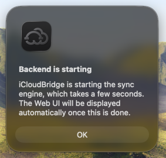
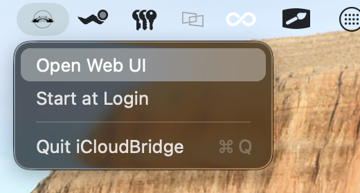

# iCloudBridge User Guide

[< Back to Table of Contents](user.md)

## Installing iCloudBridge

You'll start by downloading the latest release of iCloudBridge from the [GitHub Releases page](). You can also get the latest version from the website - [icloudbridge.app](https://icloudbridge.app).

Once you've downloaded the app, simply double-click the `.dmg` file and drag the iCloudBridge app to your Applications folder.

## Launching the WebUI

On launching iCloudBridge, you'll see a menubar icon appear at the top of your screen. For this first few seconds, the sync engine will be starting up, and therefore the Web UI will be unavailable. This is indicated by a clock on the menubar icon:

Also, if you try to launch the Web UI at this point, you will be informed that the sync engine is still starting. Once it has started, the Web UI will open automatically.

Once iCloudBridge has started, click on the menubar icon and select "Open Web UI" from the dropdown menu. This will open the web interface in your default browser.

From the same menu, you can also choose to Start iCloudBridge at Login. You probably want to do this, especially if you plan on using the Scheduler for automated synchronisation.

---

[< Previous - Contents](user.md) | [Next - The First-Run Wizard >](firstrun.md)