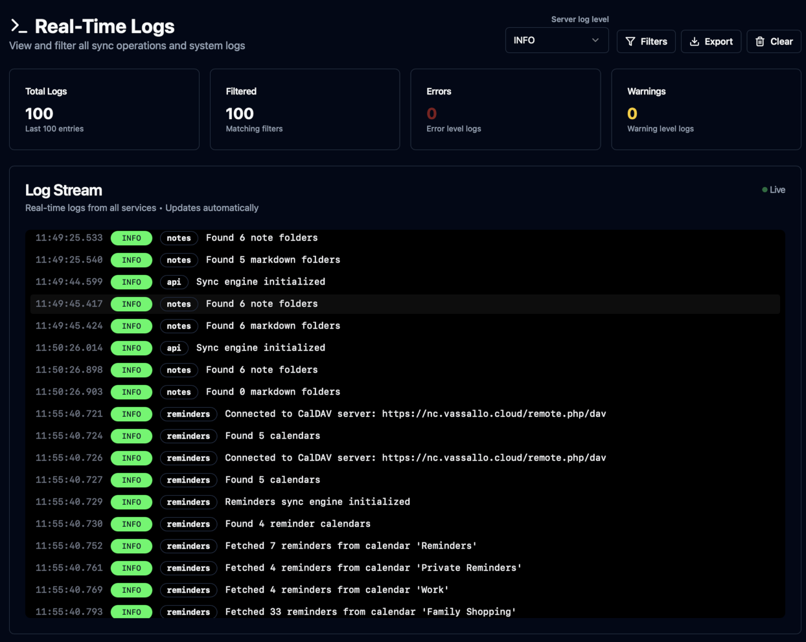
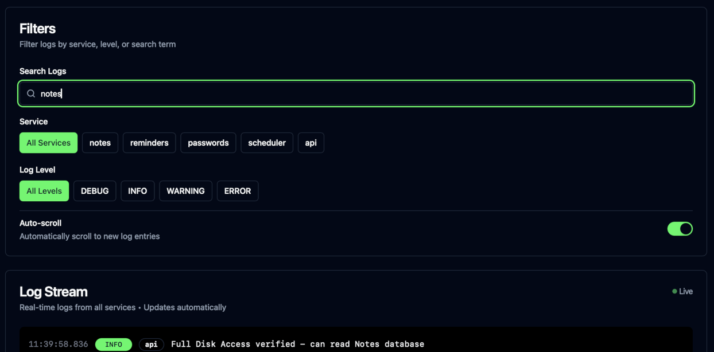

# iCloudBridge User Guide

[< Back to Table of Contents](user.md)

## The Logs Page
The Lops page lets you keep a close eye on everything that iCloudBridge is doing. 

### Features
By default, the logging level is set to INFO. This strikes a balance between showing useful information and not flooding the log stream. The available logging levels are:

- **ERROR**: Only shows critical error messages.
- **WARNING**: Shows warnings, as well as critical error messages. 
- **INFO** (default): Shows informational messages, warnings and critical errors.
- **DEBUG**: Shows absolutely everything.

> [!CAUTION]
> DEBUG logging level is intended for troubleshooting purposes only and will **considerably** slow down iCloudBridge. Use it only when absolutely required.

You can easily filter through logs using the Filter panel.

The Export feature will export your logs to a CSV file. This can be useful when requesting support or submitting a bug. 

[< Previous - Schedules](schedules.md)