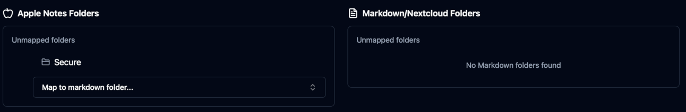

# iCloudBridge User Guide

[< Back to Table of Contents](user.md)

## The Notes Page
The Notes page in the iCloudBridge WebUI allows you to manage the synchronisation of your Apple Notes with your chosen service. From this page, you can select which folders to sync, configure folder mappings, simulate synchronisations, and trigger manual syncs.

### Sync Configuration
iCloudBridge can sync your notes in two ways: Auto or Manual. 

In **Auto** mode, folders in Apple Notes are automatically mapped to folders in your destination location. For example, if your have a folder called "Work" in Apple Notes, it will be synced to a folder called "Work" in your destination location. If the folder does not exist in the destination, it will be created. This is bidirectional - folders in the destination which don't exist in Apple Notes will also be created.

In **Manual** mode, you can specify exactly which folders in Apple Notes map to which folders in your destination location. This gives you more control over where your notes are stored. You can also leave folders unmapped, and these will not be synced. 

> [!TIP]
> If you have a folder with password-protected notes, you'll probably want to exclude this folder from synchronisation, as these notes cannot be decrypted by iCloudBridge.

### Auto Mode
In **Auto** mode, you can see a list of which folders from Apple Notes will be mapped with which folders in your destination location. 

In the above screenshot, you can see that folders in Apple Notes which have the same name in the destination location will be mapped together. Folders which don't exist in the destination will be created during synchronisation. So, for example, during the first sync a "Secure" folder will bve created in the destination location, whilst an "Ongoing Projects" will be created under "Work" in Apple Notes.

If your desintation location is empty, all folders will be created, as shown below:

### Manual Mode
In **Manual** mode, you can specify exactly which folders in Apple Notes map to which folders in your destination location.

For each folder in Apple Notes, you can select a corresponding folder in your destination location from the dropdown menu. If the destination folder does not exist, you can simply type any name to create that folder. 

This also works the other way around - for each folder in your destination location, you can select a corresponding folder in Apple Notes, or create a new one if it doesn't exist.

If there are any folders which you don't want to sync, simply do not map the folder:

Once you've configured your folder mappings, you can also choose the sync direction for each mapping. You can choose to sync notes bidirectionally, or only from Apple Notes to the destination location, or vice versa.

> [!TIP]
> Ensure you click the "Save Mappings" button after making any changes to your folder mappings or sync directions.

### Syncing Notes
Before you run your first sync, it's a good idea to simulate the synchronisation first. This will show you what changes will be made without actually performing the sync. To do this, simply click the "Simulate Sync" button.

The simulation results will show you which notes will be created, updated, or deleted in both Apple Notes and your destination location. Clicking on any of the folders will also show what individual notes will be synced:

Once you're happy with the simulation results, you can proceed to perform the actual synchronisation by clicking the "Run Sync" button. Once the sync is complete, you'll see a summary of the changes made:

You'll also see an entry in the Sync history:

And that's all there is to it! Check out the [Schedules](schedules.md) page to set up automated synchronisations for your notes.

---

[< Previous - Using the Web UI](navigation.md) | [Next - Reminder Synchronisation >](reminders.md)