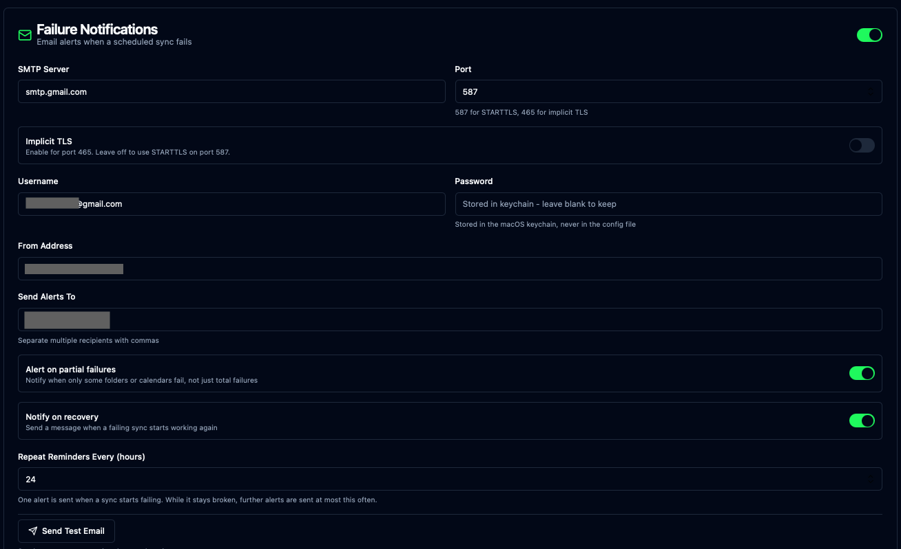

# iCloudBridge User Guide

[< Back to Table of Contents](user.md)

## Failure Notifications

Scheduled syncs run quietly in the background, which is exactly what you want until something breaks. Failure Notifications send you an email when a scheduled sync fails, so you find out on the day it happens rather than weeks later when you notice a reminder never made it to your phone.

> [!NOTE]
> Notifications cover **scheduled** syncs only. Syncs you trigger yourself from the Notes, Reminders or Photos pages report their result on screen, so there is nothing to notify you about.

### Setting Up

Open the Settings page and find the "Failure Notifications" card, then switch it on to reveal the settings.



You'll need an SMTP server to send through. Any mail provider will do; the settings below are for Gmail, which is the most common case.

| Setting | What to enter |
| --- | --- |
| SMTP Server | Your provider's outgoing mail server, e.g. `smtp.gmail.com` |
| Port | `587` for STARTTLS (the usual choice), or `465` with "Implicit TLS" switched on |
| Username | The account you're sending through, usually your full email address |
| Password | The password for that account |
| From Address | The address the alerts should come from |
| Send Alerts To | Where to send them. Separate multiple recipients with commas |

Click "Save Settings" when you're done, then click "Send Test Email" to confirm it all works. If something is wrong, the error from the mail server is shown as-is, which usually makes the problem obvious - a wrong port, a rejected password, an unknown host.

> [!TIP]
> The test button uses the **saved** settings, so save your changes before testing. The button stays disabled until you do.

#### Using Gmail

Google no longer accepts your normal account password for sending mail, so you need an app-specific password:

1. Enable 2-Step Verification on your Google account, if you haven't already. App passwords aren't available without it.
2. Go to [myaccount.google.com/apppasswords](https://myaccount.google.com/apppasswords) and generate a password for iCloudBridge.
3. Paste the 16-character password into the Password field.

Use `smtp.gmail.com` on port `587`, with your full Gmail address as both the Username and the From Address.

> [!WARNING]
> Gmail rewrites the From address to the account you authenticated as, unless the address you enter is a verified alias under Gmail's Settings → Accounts → "Send mail as". If you set a From Address that isn't verified there, your alerts will still arrive, but they'll come from your Gmail address instead. Using the account's own address avoids the surprise.
>
> Google Workspace administrators can disable app passwords for the whole organisation. If the app passwords page doesn't offer you the option, you'll need to send through a different mail server.

#### Where Your Password Is Stored

The SMTP password is stored in the macOS Keychain, exactly like your CalDAV and Vaultwarden credentials. It is never written to the configuration file. Once saved, the Password field shows a placeholder rather than the password itself - leave it blank when changing other settings and your saved password is kept.

### How Often You'll Be Emailed

A sync that breaks usually stays broken until you do something about it. Left unchecked, a schedule running every 30 minutes would email you 48 times a day, and you'd stop reading them by lunchtime.

Instead, iCloudBridge sends:

- **One email when a sync starts failing.** This is the one that matters.
- **A reminder at most once every 24 hours** for as long as it keeps failing, telling you how long it's been broken and how many runs have failed.
- **One email when it recovers**, so you know it's sorted.

You can change the 24-hour figure with the "Repeat Reminders Every (hours)" setting, or turn recovery messages off entirely.

### Partial Failures

A sync doesn't always fail as a whole. You might have five note folders syncing where only one fails, perhaps because a single folder's destination is unavailable. iCloudBridge treats this as a *partial failure* - the Dashboard shows it as "Partial Success" rather than a plain success or a failure.

By default you're emailed about these too, since a folder that has quietly stopped syncing is worth knowing about. If you'd rather only hear about complete failures, switch off "Alert on partial failures".

### What the Emails Contain

Each alert names the schedule and the service, says how much failed, tells you when the trouble started and how many runs have failed since, and lists the individual failures.

```
Scheduled sync 'Every 30 Minutes' (reminders) reported failures.

All 4 folder(s)/calendar(s) failed.
First failed: 2026-08-06 17:52:12
Failed runs since: 1

Failures:
  - Reminders → Reminders: Failed to create Apple calendar: Reminders
  - Work → Work: Failed to create Apple calendar: Work
  ...
```

When *everything* fails at once, the email includes a hint about the most likely cause. A sync that suddenly cannot see any of your reminder lists or note folders has usually lost its macOS permissions rather than lost your data - see [Troubleshooting](#troubleshooting) below.

### Troubleshooting

**No email arrives, and the test email works.**
Notifications only fire for scheduled syncs. Check that the schedule actually ran, on the [Logs](logs.md) page or from the Dashboard.

**No email arrives, and the test email fails.**
The error shown when testing comes straight from the mail server. "Authentication failed" on Gmail almost always means a normal password was used instead of an app password. A hang or timeout usually means the wrong port, or Implicit TLS set when the server expects STARTTLS.

**Every folder or list failed at once.**
This is rarely a sync problem. macOS grants permissions to a specific program, and a Python upgrade on your Mac can replace the one iCloudBridge runs on - at which point macOS silently withdraws its access to Reminders, Photos and your files. Syncs then see nothing at all rather than an error.

Quitting and reopening iCloudBridge rebuilds its environment and restores access. You may be prompted to grant permissions again, which is expected.

> [!NOTE]
> If this happens, your data is safe. iCloudBridge refuses to delete anything when a source becomes unreadable, precisely so that a permissions problem can't be mistaken for you having deleted everything.

**Emails stop arriving while a sync is still broken.**
That's the 24-hour repeat interval doing its job. Lower "Repeat Reminders Every (hours)" if you want to be told more often.

---

[< Previous - Schedules](schedules.md) | [Next - Logs >](logs.md)
