# iCloudBridge User Guide

[< Back to Table of Contents](user.md)

## The Passwords Page
The Passwords page in the iCloudBridge WebUI allows you to manage the synchronisation of passwords stored in Apple Passwords with your chosen service. From this page, you can perform a synchronisation or simulate a sync to see what would change. 

### How it Works & Limitations
Unlike Notes, Reminders and Photos, Passwords does not support automatic synchronisation. This means that you need to carry out the sync manually. iCloudBridge tries to make this process as simple as possible. Here's how it works:

1. Export your passwords to a CSV file from Apple Passwords. 
2. Import your passwords export into iCloudBridge. 
3. iCloudBridge sends any new/updated passwords to your remote location (i.e. Bitwarden, Vaultwarden or Nextcloud Passwords). 
4. Any new passwords found remotely are imported, and you are given a CSV file to import into Apple Passwords. 

> [!NOTE]
> One-Time Passwords (also known as TOTP, used for two-factor authentication) are supported, but only if you're using Bitwarden or Vaultwarden

> [!NOTE]
> Passkeys are **not** synchronised. There is no current mechanism for extracting these from Apple Passwords. 

### Syncing Passwords (Bidirectional)
To start a sync, you'll need to export your passwords from Apple Passwords. From Apple Passwords, click File > Export All Passwords to File...

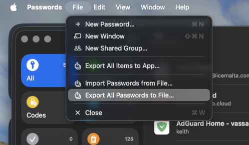

This creates a CSV file in the folder you choose. 

Next, from iCloudBridge, click "Upload Apple CSV" and choose the CSV file you just exported from Apple Passwords. 

At this point, you should probably run a simulation (especially if this is your first sync) as a sanity check. Click "Simulate", and observe the results:

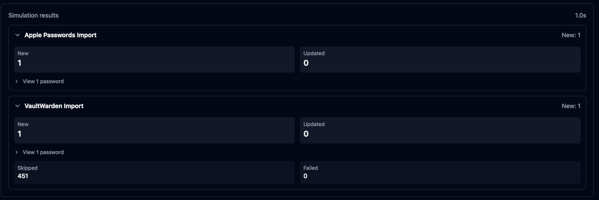

Here we see that if we had to run a sync, we'd get 1 new password in Apple Passwords, and another in Vaultwarden (this would look the same for Bitwarden or Nextcloud Passwords). 

You can expand the result to see which passwords would actually be imported:

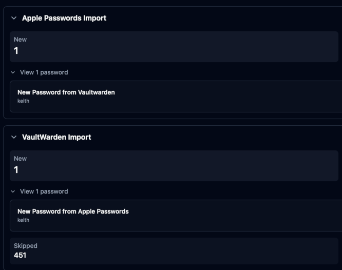

So here, we'd get a new password titled "New Password from Vaultwarden" in Apple Passwords, and a new password titled "New Password from Apple Passwords" in Vaultwarden. 

Once you've confirmed everything looks good, you can proceed to an actual sync, by clicking the "Sync" button. You'll see results similar to a simulation, except this time the sync actually added passwords to Bitwarden/Vaultwarden or Nextcloud Passwords, and a file has been prepared for import into Apple Passwords.

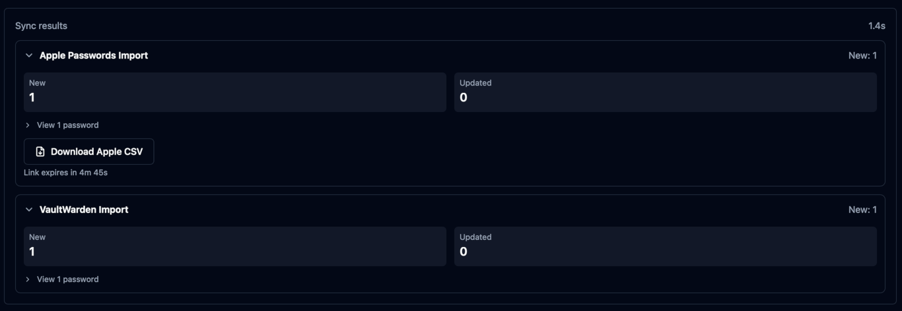

If passwords need to be imported into Apple Passwords, you'll see a button to download a CSV file for import. 

> [!IMPORTANT]
> For your security, the download link expires after 5 minutes, so make sure you download it!

Importing this file into Apple Passwords is easy. Simply click File > Import Passwords from File... and choose the CSV you just downloaded from iCloudBridge.

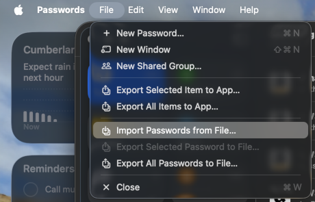

Your new password will now be visible in Apple Passwords. 

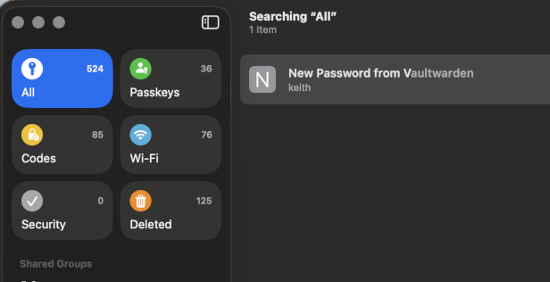

> [!WARNING]
> After importing, Apple Passwords will ask whether you want to delete the import file. Go ahead and do this - as this file contains plain-text passwords!

You can also check Bitwarden/Vaultwarden or Nextcloud passwords to confirm that your new passwords were imported. 

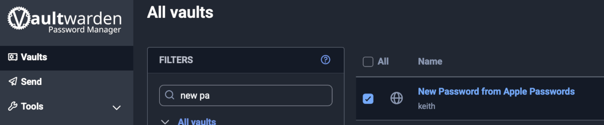

### Unidirectional Sync

Besides the bidirectional sync, you can also do an Export (i.e. Apple Passwords to another service) or an Import (Another service to Apple Passwords). 

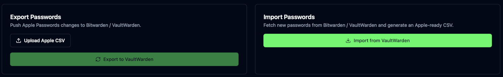

### Verification codes from Ente Auth

If you keep your verification codes in Ente Auth, iCloudBridge can work out which Apple Passwords login each one belongs to. Apple Passwords doesn't let apps add a verification code to a login, so you still add each code yourself, but you get a checklist with the setup key for every login.

> [!NOTE]
> This doesn't sync your codes. It's a one-off: if you add codes to Ente Auth later, export both files again and run it again.

First, export your codes from Ente Auth: open Settings > Data > Export codes and choose Plain text. Then export your passwords from Apple Passwords with File > Export All Passwords to File..., just like for a sync.

> [!NOTE]
> An encrypted Ente export can't be read. Decrypt it first with `ente auth decrypt <export_file> <output_file>`, then upload the plain-text file.

Next, open **Verification codes from Ente Auth** at the bottom of the Passwords page. It only shows when "Enable Passwords Sync" is on in Settings. Click "Apple Passwords CSV" and choose your Apple Passwords export, click "Ente Auth export" and choose your Ente export, then click "Preview".

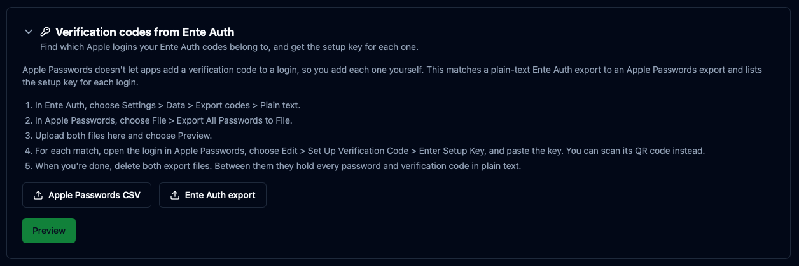

iCloudBridge lists every Apple login it found a code for:

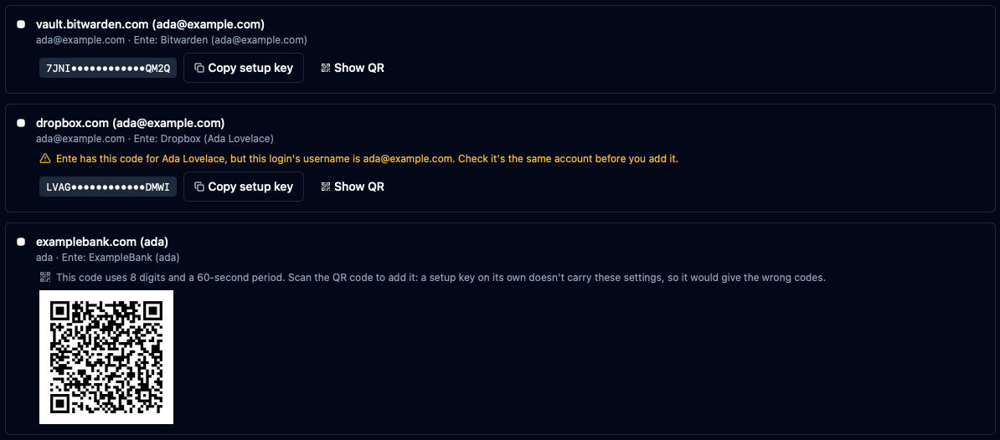

For each one, open the login in Apple Passwords and choose Edit > Set Up Verification Code > Enter Setup Key. Click "Copy setup key" in iCloudBridge and paste it in. If you'd rather scan, click "Show QR" and scan the code with Apple Passwords on your iPhone. Tick each login off as you go. The ticks aren't saved, so they're gone if you leave the page.

Two kinds of login need a closer look:

- **A warning about the username**: the login was matched on the service name alone, and Ente has the code for a different account name. Check it's the same account before you add the code. Above, Ente has the Dropbox code for "Ada Lovelace", but the login's username is an email address.
- **QR code only**: the code uses settings other than 6 digits every 30 seconds, such as 8 digits. A setup key on its own doesn't carry those settings and would give the wrong codes, so scan the QR code instead.

Below the list are the codes that aren't in the checklist. Click a heading to see them.

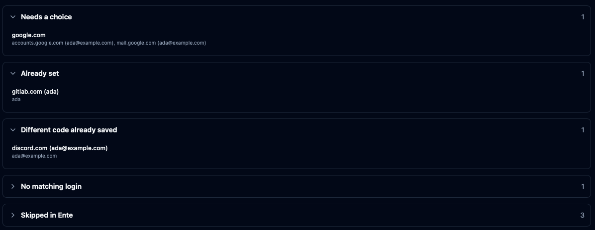

- **Needs a choice**: more than one login could fit the code, so nothing is chosen for you. Add it from Ente Auth to the right login yourself.
- **Already set**: the login already has this code.
- **Different code already saved**: the login already has a different code, and iCloudBridge leaves it alone.
- **No matching login**: there's no login for this code in Apple Passwords. Apple Passwords can only add a code to an existing login.
- **Skipped in Ente**: codes you've trashed in Ente Auth, and HOTP and Steam codes, which Apple Passwords doesn't support.

> [!WARNING]
> When you're done, delete both export files. Between them they hold every password and verification code in plain text. iCloudBridge doesn't keep a copy of either.

---

[< Previous - Reminder Synchronisation](reminders.md) | [Next - Photo Synchronisation >](photos.md)
