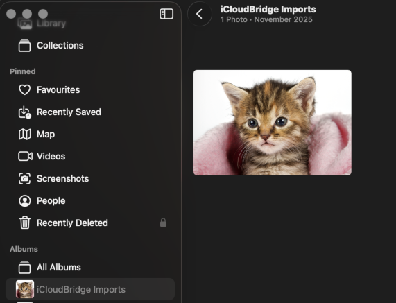

# iCloudBridge User Guide

[< Back to Table of Contents](user.md)

## The Photos Page
The Photos page allows you to synchronise new photos from your non-Apple photo library into Apple Photos. You can also simulate a sync. 

### How it Works

> [!TIP]
> Don't skip this part, it's important!

iCloudBridge photo sync is **designed** to be one-way. It's function is to detect new photos you've added in your photos folder (for example the one you use on Nextcloud) and to import them into your Apple Photos library. The idea is to facilitate keeping your libraries in sync. Here's a description of how this works.

1. Bob takes a photo on his iPhone. iCloud syncs this to his photo library, whilst the Nextcloud app on his phone syncs it to Nextcloud (using the Auto Upload feature). 
2. When using his Android phone, Bob can see the photos he took on his iPhone using Nextcloud. 
3. Bob takes a photo on his Android phone. The Nextcloud app on his phone syncs it to Nextcloud. 
4. **This is where iCloudBridge comes in**. iCloudBridge detects a new photo in Bob's Nextcloud library, and syncs it to his Apple Photos library. 
5. When using his iPhone, Bob can now see the photos he took on his Android phone using the Apple Photos app. 

As you can see, the photo sync functionality is designed to complement an existing one-way sync feature, such as that offered by Nextcloud. Whilst the focus is Nextcloud, nothing really stops you from using any other sync service, as long as your photos are stored in a folder on your Mac.

### Syncing
From the Photos page, click Simulate. 

How long this takes depends on your Mac's speed and the size of your photo library. On my M1 Max with 15,000 photos, the scan takes roughly 90 seconds - so it's not too bad!

> [!TIP]
> You may notice that the number of files scanned does not match the number of photos in your library. This is mostly due to live photos consisting of both a photo and a video.

After the simulation runs, you will be shown what would happen had you to sync:

Here, I'm shown that one new photo would be imported into Apple Photos. 

If this makes sense, go ahead and click "Sync" to carry out the actual sync.

A new photo was imported into Apple Photos. You can verify this by checking your import album:

---

[< Previous - Password Synchronisation](passwords.md) | [Next - Schedules >](schedules.md)