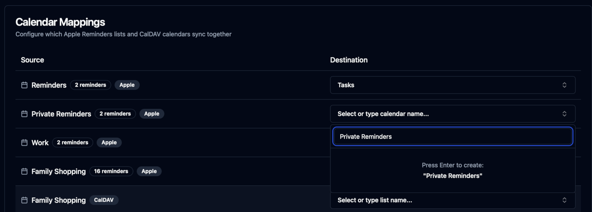
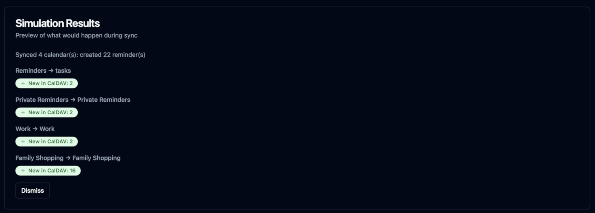

# iCloudBridge User Guide

[< Back to Table of Contents](user.md)

## The Reminders Page
The Reminders page in the iCloudBridge WebUI allows you to manage the synchronisation of your Apple Reminders with your chosen service. From this page, you can select which lists to sync, configure calendar mappings, simulate synchronisations, and trigger manual syncs.

### Sync Configuration
iCloudBridge can sync your reminders in two ways: Auto or Manual.

In **Auto** mode, lists in Apple Reminders are automatically mapped to calendars in your destination location. For example, if your have a list called "Groceries" in Apple Reminders, it will be synced to a calendar called "Groceries" in your destination location. If the calendar does not exist in the destination, it will be created. This is bidirectional - calendars in the destination which don't exist as lists in Apple Reminders will also be created.

In **Manual** mode, you can specify exactly which lists in Apple Reminders map to which calendars in your destination location. This gives you more control over where your reminders are stored. You can also leave lists unmapped, and these will not be synced.

### Auto Mode
In **Auto** mode, you can see a list of which lists from Apple Reminders will be mapped with which calendars in your destination location.

In the above screenshot, you can see that lists in Apple Reminders which have the same name in the destination location will be mapped together. Lists which don't exist in the destination will be created during synchronisation. So, for example, during the first sync a "Private Reminders" calendar will bve created in the destination location, whilst a "Confidential" list will be created in Apple Notes.

> [!NOTE]
> If the reminder count displayed does not match Apple Reminders, remember that completed reminders are also counted!

### Manual Mode
In **Manual** mode, you can specify which lists from Apple Reminders map with which calendars in your destination location. 

In the example below, the Apple Reminders list "Work" is being mapped with the existing CalDAV calendar also called "Work":

If the destination calendar does not exist, you can type in a new name to create it:

> [!TIP]
> Ensure you click the "Save Mappings" button after making any changes to your list/calendar mappings.

### Syncing Reminders
Before you run your first sync, it's a good idea to simulate the synchronisation first. This will show you what changes will be made without actually performing the sync. To do this, simply click the "Simulate Sync" button.

The simulation results will show you which reminders will be created, updated, or deleted in both Apple Reminders and your destination location. Hovering on any of the badges will also show what individual reminders will be synced:

Once you're happy with the simulation results, you can proceed to perform the actual synchronisation by clicking the "Run Sync" button. Once the sync is complete, you'll see a summary of the changes made:

You'll also see an entry in the Sync history:

And that's all there is to it! Check out the [Schedules](schedules.md) page to set up automated synchronisations for your reminders.

---

[< Previous - Note Synchronisation](notes.md) | [Next - Password Synchronisation >](passwords.md)
