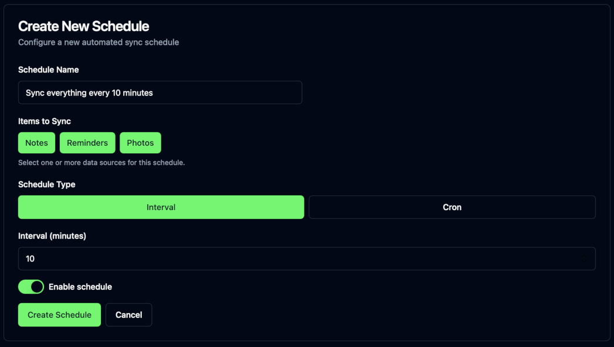

# iCloudBridge User Guide

[< Back to Table of Contents](user.md)

## The Schedules Page
The Schedules page lets you schedule automatic synchronisation for Notes, Reminders and Photos. You can create multiple schedules, and combine multiple services per schedule.

> [!CAUTION]
> It is **strongly** recommended to not create schedules that run at less than a 10 minute interval. This ensures that the previous synchronisation has completed before starting a new one.

### Creating A Schedule
Click "New Schedule" to get started. From here, you'll give the schedule a name, choose what to sync and choose a schedule type.

If you want more fine-grained control over when the schedule runs, switch to the "Cron" tab, where you can add your own Cron expression:

Your schedule will now be saved and show the next scheduled time:

### Monitoring Status

Returning to the dashboard at a later date will show you the status of the last schedule which ran.

---

[< Previous - Photo Synchronisation](photos.md) | [Next - Logs >](logs.md)